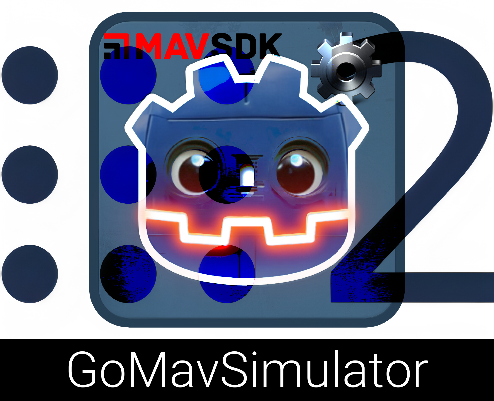
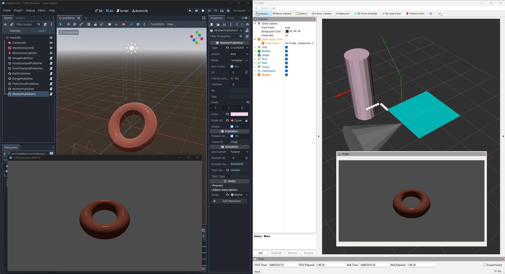

<a name="readme-top"></a>

<!-- PROJECT SHIELDS -->
[![Contributors][contributors-shield]][contributors-url]
[![Forks][forks-shield]][forks-url]
[![Stargazers][stars-shield]][stars-url]
[![Issues][issues-shield]][issues-url]
[![Apache License][license-shield]][license-url]

<!-- PROJECT LOGO -->
<br />
<div align="center">
  <a href="https://github.com/timetravelCat/GoMavSimulator">
    
  </a>

  <p align="center">
    A general perpose simulation app which is powered by Godot, MAVSDK and ROS2 for robotics applications.
    <br />
    <a href="https://github.com/timetravelCat/GoMavSimulator"><strong>Explore the docs »</strong></a>
    <br />
    <br />
    <a href="https://github.com/timetravelCat/GoMavSimulator">View Demo</a>
    ·
    <a href="https://github.com/timetravelCat/GoMavSimulator/issues">Report Bug</a>
    ·
    <a href="https://github.com/timetravelCat/GoMavSimulator/issues">Request Feature</a>
  </p>
</div>

<!-- TABLE OF CONTENTS -->
<details>
  <summary>Table of Contents</summary>
  <ol>
    <li>
      <a href="#about-the-project">About The Project</a>
      <ul>
        <li><a href="#built-with">Built With</a></li>
      </ul>
    </li>
    <li>
      <a href="#getting-started">Getting Started</a>
    </li>
    <li><a href="#usage">Usage</a></li>
    <li><a href="#installation-from-sources">Installation from sources</a></li>
    <li><a href="#gdextension">GDExtension</a></li>
      <ul>
        <li><a href="#extending-gdextension">Extending GDExtension</a></li>
      </ul>
    <li><a href="#roadmap">Roadmap</a></li>
    <li><a href="#contributing">Contributing</a></li>
    <li><a href="#license">License</a></li>
    <li><a href="#contact">Contact</a></li>
    <li><a href="#acknowledgments">Acknowledgments</a></li>
  </ol>
</details>

<!-- ABOUT THE PROJECT -->
## About The Project

[![Product Name Screen Shot][product-screenshot]](https://example.com)

Here's a blank template to get started: To avoid retyping too much info. Do a search and replace with your text editor for the following: `timetravelCat`, `GoMavSimulator`, `GoMavSimulator`, `project_description`

<p align="right">(<a href="#readme-top">back to top</a>)</p>


### Built With

* [![Godot][Godot.com]][Godot-url]
* [![MAVSDK][MAVSDK.com]][MAVSDK-url]
* [![ROS2][ros2.com]][ros2-url]
* [![fastDDS][fastdds.com]][fastdds-url]

<p align="right">(<a href="#readme-top">back to top</a>)</p>

<!-- GETTING STARTED -->
## Getting Started
- Install [OpenSSL 1.1.1u](https://slproweb.com/products/Win32OpenSSL.html) 
- Add OpenSSL binary path(C:\Program Files\OpenSSL-Win64\bin\) to System PATH
- Download latest [release](https://github.com/timetravelCat/GoMavSimulator/releases/)
- Configure simulation
  - Select ground-truth position/orientation topics from MAVSDK or ROS2
  - Setup sensors (image, depth image, PointClouds, range ...)

<!-- USAGE EXAMPLES -->
## Usage

Use this space to show useful examples of how a project can be used. Additional screenshots, code examples and demos work well in this space. You may also link to more resources.

_For more examples, please refer to the [Documentation](https://example.com)_

<p align="right">(<a href="#readme-top">back to top</a>)</p>


## Installation from sources

```bash
git clone https://github.com/timetravelCat/GoMavSimulator.git
```
- Open GoMavSimulator by [godot editor](https://godotengine.org/)
- Run in editor 
- Manually export by templates [Exporting projects](https://docs.godotengine.org/en/stable/tutorials/export/exporting_projects.html)

<p align="right">(<a href="#readme-top">back to top</a>)</p>


<!-- GDExtension  -->
## GDExtension
You can find examples of mavsdk / ros2dds api in addons/mavsdk:ros22ds/examples

### ROS2DDS Features 
  - Topic name can be configured by "Topic Name" property
  - Singleton class for coordinate transform(EUS, ENU, NED) are implemented (see Coordinate3D).
<details>
  <summary>Implemented Publishers / Subscribers</summary>
  <ol>
    <li><a href="https://docs.ros2.org/foxy/api/geometry_msgs/msg/PointStamped.html">PointStamped(Pub/Sub)</a></li>
    <li><a href="https://docs.ros2.org/foxy/api/geometry_msgs/msg/PoseStamped.html">PoseStamped(Pub/Sub)</a></li>
    <li><a href="https://docs.ros2.org/foxy/api/sensor_msgs/msg/PointCloud2.html">PointCloud(Pub/Sub)</a></li>
    <li><a href="https://docs.ros2.org/foxy/api/nav_msgs/msg/Path.html">Path(Pub/Sub)</a></li>
    <li><a href="https://docs.ros2.org/foxy/api/visualization_msgs/msg/Marker.html">Marker(Pub/Sub)</a></li>
    <li><a href="https://docs.ros2.org/foxy/api/sensor_msgs/msg/Range.html">Range(Pub)</a></li>
    <li><a href="https://docs.ros2.org/foxy/api/sensor_msgs/msg/Image.html">Image(Pub)</a></li>
    <li><a href="https://docs.ros2.org/foxy/api/sensor_msgs/msg/CompressedImage.html">CompressedImage(Pub)</a></li>
    <li><a href="https://docs.ros2.org/foxy/api/sensor_msgs/msg/CameraInfo.html">CameraInfo(Pub)</a></li>
  </ol>
</details>

### MAVSDK Features
<details>
  <summary>Implemented methods</summary>
  <ol>
    <li><a href="https://mavsdk.mavlink.io/main/en/cpp/api_reference/classmavsdk_1_1_mavsdk.html">mavsdk</a></li>
    <li><a href="https://mavsdk.mavlink.io/main/en/cpp/api_reference/classmavsdk_1_1_system.html">system</a></li>
    <li><a href="https://mavsdk.mavlink.io/main/en/cpp/api_reference/classmavsdk_1_1_shell.html">shell</a></li>
    <li><a href="https://mavsdk.mavlink.io/main/en/cpp/api_reference/classmavsdk_1_1_param.html">param</a></li>
    <li><a href="https://mavsdk.mavlink.io/main/en/cpp/api_reference/classmavsdk_1_1_mavlink_passthrough.html">mavlink_passthrouth</a></li>
  </ol>
</details>


<p align="right">(<a href="#readme-top">back to top</a>)</p>

## Extending GDExtension
Extending mavsdk or ros2 messaging requires source build of each library.

Supported platform & required dependency: 

(If you installed [ros2](https://docs.ros.org/en/iron/Installation/Windows-Install-Binary.html) in your system, maybe all dependencies are already satisfied.)

Serial GDextension is based on [matrixant](https://github.com/matrixant/serial_port), [serial](https://github.com/wjwwood/serial).

- Windows
  - https://chocolatey.org/install
    ```powershell
      choco install -y python --version 3.8.3
      choco install -y curl
    ```
  - [OpenSSL 1.1.1u](https://slproweb.com/products/Win32OpenSSL.html) 
  - Windows SDK, from [Visual Studio 2019](https://visualstudio.microsoft.com/thank-you-downloading-visual-studio/?sku=Community&rel=16&src=myvs&utm_medium=microsoft&utm_source=my.visualstudio.com&utm_campaign=download&utm_content=vs+community+2019) 
  
- Linux
  ```sh
  ./extensions/ubuntu_setup.sh # Tested on ubuntu 22.04
  ```

### Steps for rebuilding shared library.
- Building dependency libraries
  ```bash
  cd extensions
  mkdir -p build 
  cmake ..
  # You can enable/disable build for mavsdk / ros2dds / serial by cmake option ROS2_DDS, MAVSDK, SERIAL
  # If you are using Windows, You may need manually set path for curl.
  # set CURL_INCLUDE_DIRS, CURL_LIBRARIES properly.
  cmake --build . --config Release
  ```
- Building GDExtension shared libraries
  ```bash
  cd mavsdk # ros2dds or serial
  scons # target=template_release
  ```

<p align="right">(<a href="#readme-top">back to top</a>)</p>

<!-- ROADMAP -->
## Roadmap

- [ ] Feature 1
- [ ] Feature 2
- [ ] Feature 3
    - [ ] Nested Feature

See the [open issues](https://github.com/timetravelCat/GoMavSimulator/issues) for a full list of proposed features (and known issues).

<p align="right">(<a href="#readme-top">back to top</a>)</p>


<!-- CONTRIBUTING -->
## Contributing

Contributions are what make the open source community such an amazing place to learn, inspire, and create. Any contributions you make are **greatly appreciated**.

If you have a suggestion that would make this better, please fork the repo and create a pull request. You can also simply open an issue with the tag "enhancement".
Don't forget to give the project a star! Thanks again!

1. Fork the Project
2. Create your Feature Branch (`git checkout -b feature/AmazingFeature`)
3. Commit your Changes (`git commit -m 'Add some AmazingFeature'`)
4. Push to the Branch (`git push origin feature/AmazingFeature`)
5. Open a Pull Request

<p align="right">(<a href="#readme-top">back to top</a>)</p>


<!-- LICENSE -->
## License

Distributed under the Apache License. See `LICENSE.txt` for more information.

<p align="right">(<a href="#readme-top">back to top</a>)</p>


<!-- CONTACT -->
## Contact

timetravelCat - timetraveler930@gmail.com

Project Link: [https://github.com/timetravelCat/GoMavSimulator](https://github.com/timetravelCat/GoMavSimulator)

<p align="right">(<a href="#readme-top">back to top</a>)</p>


<!-- ACKNOWLEDGMENTS -->
## Acknowledgments

* []()
* []()
* []()

<p align="right">(<a href="#readme-top">back to top</a>)</p>


<!-- MARKDOWN LINKS & IMAGES -->
<!-- https://www.markdownguide.org/basic-syntax/#reference-style-links -->
[contributors-shield]: https://img.shields.io/github/contributors/timetravelCat/GoMavSimulator.svg?style=for-the-badge
[contributors-url]: https://github.com/timetravelCat/GoMavSimulator/graphs/contributors
[forks-shield]: https://img.shields.io/github/forks/timetravelCat/GoMavSimulator.svg?style=for-the-badge
[forks-url]: https://github.com/timetravelCat/GoMavSimulator/network/members
[stars-shield]: https://img.shields.io/github/stars/timetravelCat/GoMavSimulator.svg?style=for-the-badge
[stars-url]: https://github.com/timetravelCat/GoMavSimulator/stargazers
[issues-shield]: https://img.shields.io/github/issues/timetravelCat/GoMavSimulator.svg?style=for-the-badge
[issues-url]: https://github.com/timetravelCat/GoMavSimulator/issues
[license-shield]: https://img.shields.io/github/license/timetravelCat/GoMavSimulator.svg?style=for-the-badge
[license-url]: https://github.com/timetravelCat/GoMavSimulator/blob/main/LICENSE.txt
[product-screenshot]: images/screenshot.png

[Godot.com]: extra/logo_godot.png
[Godot-url]: https://godotengine.org
[MAVSDK.com]: extra/logo_mavsdk.png
[MAVSDK-url]: https://mavsdk.mavlink.io/main/en
[ros2.com]: extra/logo_ros2.png
[ros2-url]: https://docs.ros.org
[fastdds.com]: extra/logo_fastdds.png
[fastdds-url]: https://www.eprosima.com
