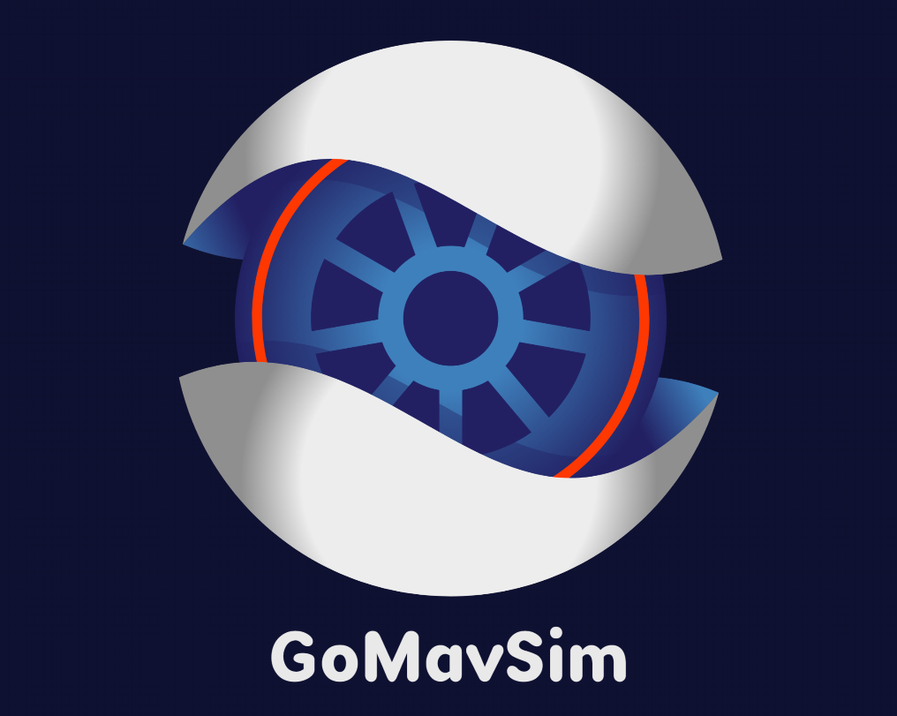

<a name="readme-top"></a>

<!-- PROJECT SHIELDS -->
[![Contributors][contributors-shield]][contributors-url]
[![Forks][forks-shield]][forks-url]
[![Stargazers][stars-shield]][stars-url]
[![Issues][issues-shield]][issues-url]
[![Apache License][license-shield]][license-url]

<!-- PROJECT LOGO -->
<br />
<div align="center">
  <a href="https://github.com/timetravelCat/GoMavSimulator">
    
  </a>

  <p align="center">
    A general perpose simulation app which is powered by Godot, MAVSDK and ROS2 for robotics applications.
    <br />
    <a href="https://github.com/timetravelCat/GoMavSimulator/tree/main/docs"><strong>Explore the docs »</strong></a>
    <br />
    <br />
    <a href="https://github.com/timetravelCat/GoMavSimulator">View Demo</a>
    ·
    <a href="https://github.com/timetravelCat/GoMavSimulator/issues">Report Bug</a>
    ·
    <a href="https://github.com/timetravelCat/GoMavSimulator/issues">Request Feature</a>
  </p>
</div>

<!-- TABLE OF CONTENTS -->
<details>
  <summary>Table of Contents</summary>
  <ol>
    <li>
      <a href="#about-the-project">About The Project</a>
      <ul>
        <li><a href="#built-with">Built With</a></li>
      </ul>
    </li>
    <li>
      <a href="#getting-started">Getting Started</a>
    </li>
    <li><a href="#usage">Usage</a></li>
    <li><a href="#installation-from-sources">Installation from sources</a></li>
    <li><a href="#roadmap">Roadmap</a></li>
    <li><a href="#contributing">Contributing</a></li>
    <li><a href="#license">License</a></li>
    <li><a href="#contact">Contact</a></li>
  </ol>
</details>

<!-- ABOUT THE PROJECT -->
## About The Project

![Product Name Screen Shot][product-screenshot]

### GoMavSimulator is created for development of robotics applications sutch as autonomous flight/driving. It directly provide various sensor simulation results through ROS2's messaging middleware.

<p align="right">(<a href="#readme-top">back to top</a>)</p>


### Built With

* [![Godot][Godot.com]][Godot-url]
* [![MAVSDK][MAVSDK.com]][MAVSDK-url]
* [![ROS2][ros2.com]][ros2-url]
* [![fastDDS][fastdds.com]][fastdds-url]

<p align="right">(<a href="#readme-top">back to top</a>)</p>

<!-- GETTING STARTED -->
## Getting Started
- Install [OpenSSL 1.1.1u](https://slproweb.com/products/Win32OpenSSL.html) (windows only)
- Add OpenSSL binary path(C:\Program Files\OpenSSL-Win64\bin\) to System PATH
- Download latest [release](https://github.com/timetravelCat/GoMavSimulator/releases/)
- Run as admin (for windows)
- Configure simulation
  - Select ground-truth position/orientation topics from MAVSDK or ROS2
  - Setup sensors (image, depth image, PointClouds, range ...)

<!-- USAGE EXAMPLES -->
## Usage

![Usage Scenario][usage-screenshot]
### Please refer to the [Documentation](docs/README.md)

<p align="right">(<a href="#readme-top">back to top</a>)</p>


## Installation from sources

```bash
git clone https://github.com/timetravelCat/GoMavSimulator.git
```
- Open GoMavSimulator by [godot editor](https://godotengine.org/), 4.1.1 or more recent
- Run in editor 
- Add a scene/vehicle model/sensor, [Documentation](https://github.com/timetravelCat/GoMavSimulator/blob/main/docs/Development.md)
- Manually export by templates [Exporting projects](https://docs.godotengine.org/en/stable/tutorials/export/exporting_projects.html)

<p align="right">(<a href="#readme-top">back to top</a>)</p>

<!-- ROADMAP -->
## Roadmap
See the [open issues](https://github.com/timetravelCat/GoMavSimulator/issues) for a full list of proposed features (and known issues).

<p align="right">(<a href="#readme-top">back to top</a>)</p>


<!-- CONTRIBUTING -->
## Contributing

Contributions are what make the open source community such an amazing place to learn, inspire, and create. Any contributions you make are **greatly appreciated**.

If you have a suggestion that would make this better, please fork the repo and create a pull request. You can also simply open an issue with the tag "enhancement".
Don't forget to give the project a star! Thanks again!

1. Fork the Project
2. Create your Feature Branch (`git checkout -b feature/AmazingFeature`)
3. Commit your Changes (`git commit -m 'Add some AmazingFeature'`)
4. Push to the Branch (`git push origin feature/AmazingFeature`)
5. Open a Pull Request

<p align="right">(<a href="#readme-top">back to top</a>)</p>


<!-- LICENSE -->
## License

Distributed under the Apache License. See `LICENSE.txt` for more information.

<p align="right">(<a href="#readme-top">back to top</a>)</p>


<!-- CONTACT -->
## Contact

timetravelCat - timetraveler930@gmail.com

Project Link: [https://github.com/timetravelCat/GoMavSimulator](https://github.com/timetravelCat/GoMavSimulator)

<p align="right">(<a href="#readme-top">back to top</a>)</p>


<!-- MARKDOWN LINKS & IMAGES -->
<!-- https://www.markdownguide.org/basic-syntax/#reference-style-links -->
[contributors-shield]: https://img.shields.io/github/contributors/timetravelCat/GoMavSimulator.svg?style=for-the-badge
[contributors-url]: https://github.com/timetravelCat/GoMavSimulator/graphs/contributors
[forks-shield]: https://img.shields.io/github/forks/timetravelCat/GoMavSimulator.svg?style=for-the-badge
[forks-url]: https://github.com/timetravelCat/GoMavSimulator/network/members
[stars-shield]: https://img.shields.io/github/stars/timetravelCat/GoMavSimulator.svg?style=for-the-badge
[stars-url]: https://github.com/timetravelCat/GoMavSimulator/stargazers
[issues-shield]: https://img.shields.io/github/issues/timetravelCat/GoMavSimulator.svg?style=for-the-badge
[issues-url]: https://github.com/timetravelCat/GoMavSimulator/issues
[license-shield]: https://img.shields.io/github/license/timetravelCat/GoMavSimulator.svg?style=for-the-badge
[license-url]: https://github.com/timetravelCat/GoMavSimulator/blob/main/LICENSE.txt
[product-screenshot]: docs/screenshots/GoMavSimulatorUsage.png
[usage-screenshot]: docs/screenshots/SimpleUsage.png

[Godot.com]: extra/logo_godot.png
[Godot-url]: https://godotengine.org
[MAVSDK.com]: extra/logo_mavsdk.png
[MAVSDK-url]: https://mavsdk.mavlink.io/main/en
[ros2.com]: extra/logo_ros2.png
[ros2-url]: https://docs.ros.org
[fastdds.com]: extra/logo_fastdds.png
[fastdds-url]: https://www.eprosima.com
