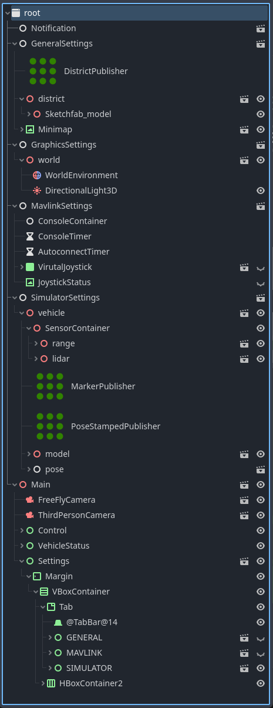
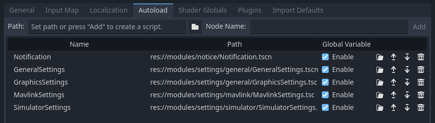
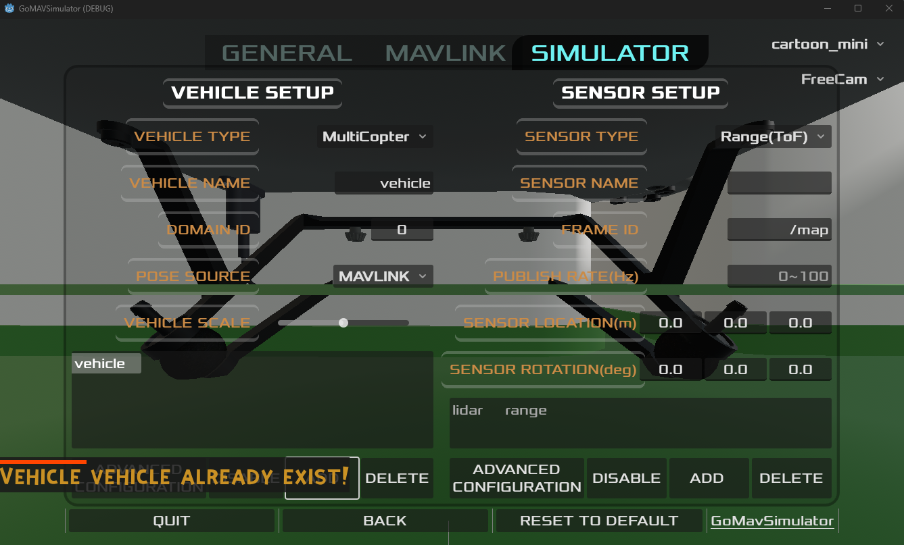

# Develop GoMavSimulator 

Here, you assumed to have experiences of godot engine.

At this time of writing(2023.07.23), GDExtension has minor bugs related to node generation.
1. Do not directly extend GDExtension node.
2. Do not @onready on GDExtension node.
3. Do not preload or static variable of including GDExtension node.

`These actions will make project unstable.`

## Adding a vehicle model
1. Import assets to res://`assets/models/ `
    * Top node of asset should be `Node3D`
2. Create inherited scene from asset to res://`modules/vehicle/model/`
    * Properly move your vehicle match with center of mass (otherwise, looks like weird)
    * `Attach VehicleModel.gd script` 
3. Open `VehicleModel.gd` and append proper info
    * `MODEL_TYPE_STRING`
    * `model_list`

## Adding a new sensor
1. Create a new sensor type in res://`modules/sensor/Sensor.gd`
    * Append new enum to SENSOR_TYPE
    * Append new string to SENSOR_TYPE_STRING
2. Create a new folder in res://`modules/sensor/`
3. Add a new scene inherit from res://`modules/sensor/Sensor.tscn`
4. Attach a new script inherit extends `Sensor`.
5. Add a publisher node and assign Publisher in Commons Settings in Inspector.
    * You need to extend GDExtension ros2 module if not proper publisher exists.
6. Connect timer node's signal to your script and publish
7. Create `@export var property_saved_list:` with settings and defaults, this property will be used for saving/load when turn on/off your simulator. (see other sensor's script for example)
8. Append a scene creation in in res://`modules/sensor/Sensor.gd`
    * in `Create()` Methods, append a new scene creation.

## Adding a new district
1. Create a district scene in res://`assets/district/`
2. Add info to res://`modules/settings/general/GeneralSettings.gd`
    * append `districts`
    * append `districts_string`

When initializing scene, collision bodies are created recursively within internal nodes. you may need to change/add or exception _create_collision_body method, if you already have collision meshes.

# Architecture of GoMavSimulator

GoMavSimulator has 5 singletone node and Main Scene.
## Notification Scene (res://modules/notice/Notification.tscn)

## GeneralSettings Scene (res://modules/settings/general/GeneralSettings.tscn)
* Manages district scene loading 
* Manages minimap scene loading (implemented in res://`modules/viewer/`)
* Manages viewer scene loading (implemented in res://`modules/viewer/`)

## GraphicsSettings Scene (res://modules/settings/general/GraphicsSettings.tscn)
* Manages sky shader(world res://`modules/world/environment/`)
* Manages DisplayServer, RenderingServer methods 

## MavlinkSettings Scene (res://modules/settings/mavlink/MavlinkSettings.tscn)
* Manages GoMAVSDKServer (GDExtension Node)
* Manages MavlinkConsole (res://`modules/console/Console.tscn`)
* Manages Joystick Scenes (res://`modules/joystick/virtual_joystick.tscn`)

## SimulatorSettings Scene (res://modules/settings/mavlink/MavlinkSettings.tscn)
* Manages Vehicle(res://`modules/vehicle/Vehicle.tscn`) 
* Manages Sensors(res://`modules/sensor/`)

## Main Scene
* Option Scene (res://`modules/settings/Settings.tscn`)
* Camera Scene (res://`modules/camera/`)