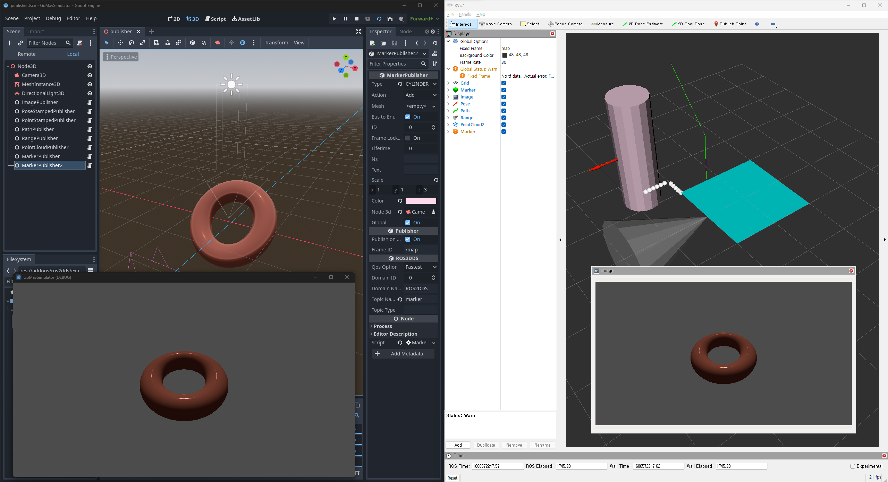

# Extending GDExtension 

### ROS2DDS Features 

  - Topic name can be configured by "Topic Name" property
  - Classes for coordinate transform(EUS, ENU, NED) are implemented (see NED2EUS ENU2EUS NED2ENU).
<details>
  <summary>Implemented Publishers / Subscribers</summary>
  <ol>
    <li><a href="https://docs.ros2.org/foxy/api/geometry_msgs/msg/PointStamped.html">PointStamped(Pub/Sub)</a></li>
    <li><a href="https://docs.ros2.org/foxy/api/geometry_msgs/msg/PoseStamped.html">PoseStamped(Pub/Sub)</a></li>
    <li><a href="https://docs.ros2.org/foxy/api/sensor_msgs/msg/PointCloud2.html">PointCloud(Pub/Sub)</a></li>
    <li><a href="https://docs.ros2.org/foxy/api/nav_msgs/msg/Path.html">Path(Pub/Sub)</a></li>
    <li><a href="https://docs.ros2.org/foxy/api/visualization_msgs/msg/Marker.html">Marker(Pub/Sub)</a></li>
    <li><a href="https://docs.ros2.org/foxy/api/sensor_msgs/msg/Range.html">Range(Pub)</a></li>
    <li><a href="https://docs.ros2.org/foxy/api/sensor_msgs/msg/Image.html">Image(Pub)</a></li>
    <li><a href="https://docs.ros2.org/foxy/api/sensor_msgs/msg/CompressedImage.html">CompressedImage(Pub)</a></li>
    <li><a href="https://docs.ros2.org/foxy/api/sensor_msgs/msg/CameraInfo.html">CameraInfo(Pub)</a></li>
  </ol>
</details>

### MAVSDK Features
<details>
  <summary>Implemented methods</summary>
  <ol>
    <li><a href="https://mavsdk.mavlink.io/main/en/cpp/api_reference/classmavsdk_1_1_mavsdk.html">mavsdk</a></li>
    <li><a href="https://mavsdk.mavlink.io/main/en/cpp/api_reference/classmavsdk_1_1_system.html">system</a></li>
    <li><a href="https://mavsdk.mavlink.io/main/en/cpp/api_reference/classmavsdk_1_1_shell.html">shell</a></li>
    <li><a href="https://mavsdk.mavlink.io/main/en/cpp/api_reference/classmavsdk_1_1_param.html">param</a></li>
    <li><a href="https://mavsdk.mavlink.io/main/en/cpp/api_reference/classmavsdk_1_1_mavlink_passthrough.html">mavlink_passthrouth</a></li>
    <li><a href="https://mavsdk.mavlink.io/main/en/cpp/api_reference/classmavsdk_1_1_manual_control.html">manual_control</a></li>
    <li><a href="https://mavsdk.mavlink.io/main/en/cpp/api_reference/classmavsdk_1_1_action.html">action</a></li>
  </ol>
</details>

### Serial Features
It's based on 
- https://github.com/wjwwood/serial
- https://github.com/matrixant/serial_port

Used for listing up connected com ports 

## Extending GDExtension
Building GDExtension module requires godot-cpp submodule
```bash
git submodule update --init --recursive
```
Extending mavsdk or ros2 messaging requires source build of each library.

Supported platform & required dependency: 

(If you installed [ros2](https://docs.ros.org/en/iron/Installation/Windows-Install-Binary.html) in your system, maybe all dependencies are already satisfied.)

Serial GDextension is based on [matrixant](https://github.com/matrixant/serial_port), [serial](https://github.com/wjwwood/serial).

- Windows
  - https://chocolatey.org/install
    ```powershell
      choco install -y python --version 3.8.3
      choco install -y curl
    ```
  - [OpenSSL 1.1.1u](https://slproweb.com/products/Win32OpenSSL.html) 
  - Windows SDK, from [Visual Studio 2019](https://visualstudio.microsoft.com/thank-you-downloading-visual-studio/?sku=Community&rel=16&src=myvs&utm_medium=microsoft&utm_source=my.visualstudio.com&utm_campaign=download&utm_content=vs+community+2019) 
  
- Linux
  ```sh
  ./extensions/ubuntu_setup.sh # Tested on ubuntu 20.04 / 22.04
  ```

### Steps for rebuilding shared library.
- Building dependency libraries
  ```bash
  cd extensions
  mkdir -p build 
  cmake ..
  # You can enable/disable build for mavsdk / ros2dds / serial by cmake option ROS2_DDS, MAVSDK, SERIAL
  # If you are using Windows, You may need manually set path for curl.
  # set CURL_INCLUDE_DIRS, CURL_LIBRARIES properly.
  cmake --build . --config Release
  ```
- Building GDExtension shared libraries
  ```bash
  cd mavsdk # ros2dds or serial
  scons # target=template_release
  ```
