# Getting Started
- Install [OpenSSL 1.1.1u](https://slproweb.com/products/Win32OpenSSL.html)
- Add OpenSSL binary path(C:\Program Files\OpenSSL-Win64\bin\) to System PATH
- Download latest [release](https://github.com/timetravelCat/GoMavSimulator/releases/)
- Run as admin (for windows)
- Configure simulation
  - Select ground-truth position/orientation topics from MAVSDK or ROS2
  - Setup sensors (image, depth image, PointClouds, range ...)
## Architecture Diagram
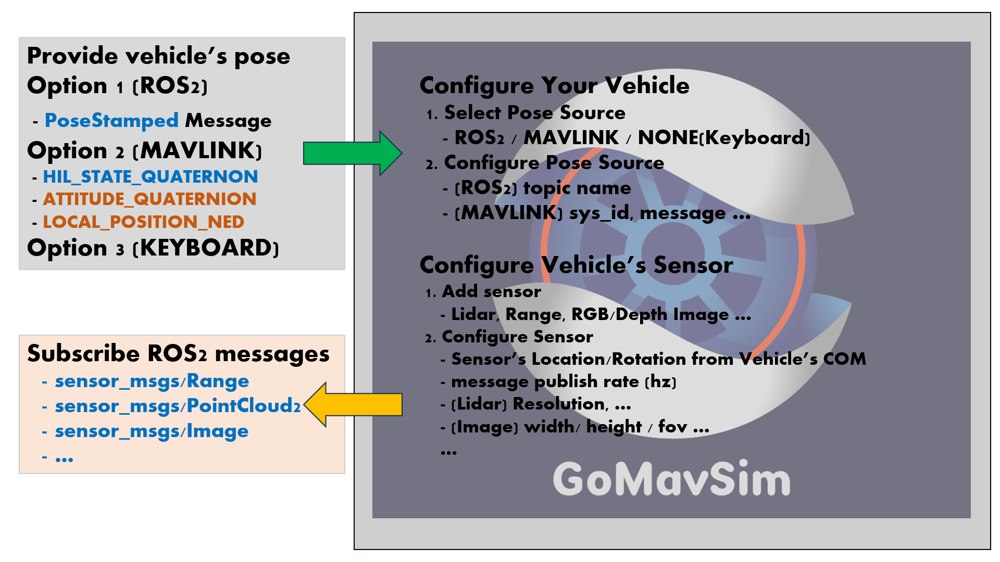

GoMavSimulator is not include any vehicle dynamics. 

GoMavSimulator requires at least one of pose source provider from
1) Mavlink
* Requires to be streamed a [HIL_STATE_QUATERNION](https://mavlink.io/en/messages/common.html#HIL_STATE_QUATERNION) or [ATTITUDE_QUATERNION](https://mavlink.io/en/messages/common.html#ATTITUDE_QUATERNION) and [LOCAL_POSITION_NED](https://mavlink.io/en/messages/common.html#LOCAL_POSITION_NED)
* Assumed NED(FRD) as a reference frame.
2) ROS2
* Publish a [PoseStamped](https://docs.ros2.org/foxy/api/geometry_msgs/msg/PoseStamped.html) topic as "[vehicle_name]/pose"
* Assumed ENU(FLU) as a reference frame.
3) NONE(by keyboard)
* Vehicle can be controlled by a keyboard/mouse like a cad controller.
* WASD for moving(on vehicle's frame), Use mouse for rotating.

## Setting up your simulation environments
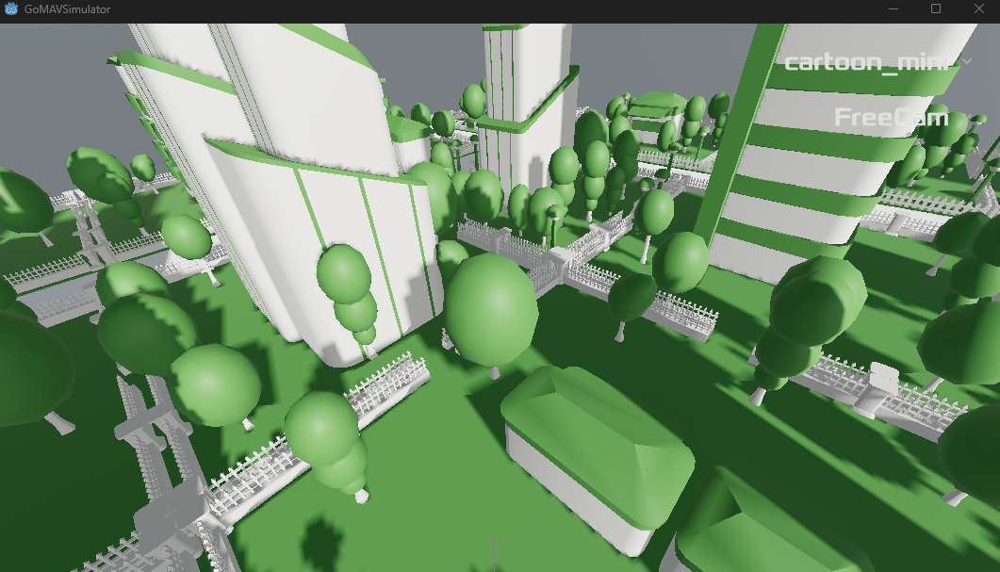
* Top right corner, you can select district, and ways to control camera
* Press ESC key open simulator settings, there are 3 taps for settings

<!-- TABLE OF CONTENTS -->

Environments/Mavlink Settings

<ol>
<li>
    
General Settings

    <ul>
    <li><a href="#graphics-settings">Graphics Settings</a></li>
    </ul>
    <ul>
    <li><a href="#minimap">Minimap</a></li>
    </ul>
    <ul>
    <li><a href="#noon-to-sunset">Noon to Sunset</a></li>
    </ul>
    <ul>
    <li><a href="#additional-viewer">Additional Viewer</a></li>
    </ul>
    <ul>
    <li><a href="#publish-district---this-is-experimental-feature">Publish district(experimental)</a></li>
    </ul>
</li>
<li>
    
Mavlink Settings

    <ul>
    <li><a href="#mavlink-console">Mavlink Console</a></li>
    </ul>
    <ul>
    <li><a href="#joystick">Joystick Control</a></li>
    </ul>
</li>
</ol>

After setting up the environments, You need to configure vehicle settings. 
See [Simulator Settings](./Settings.md).

### General Settings
#### Graphics Settings
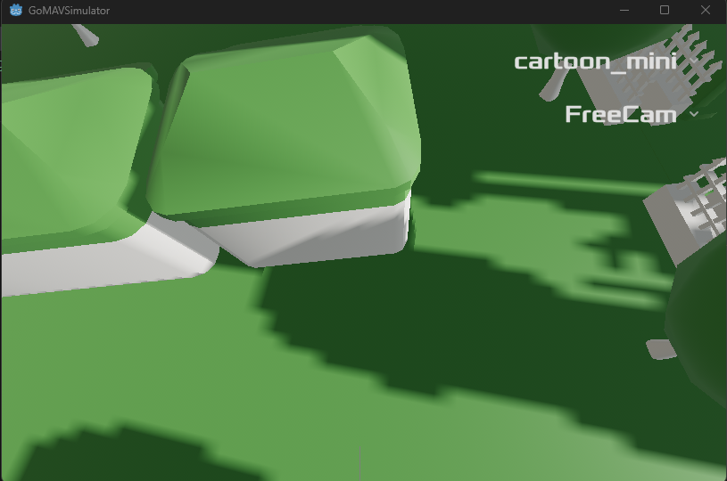
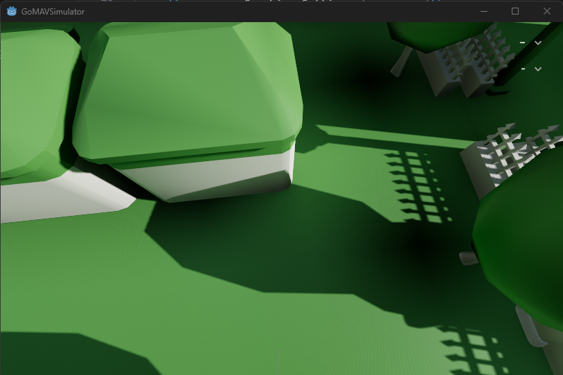

#### Minimap
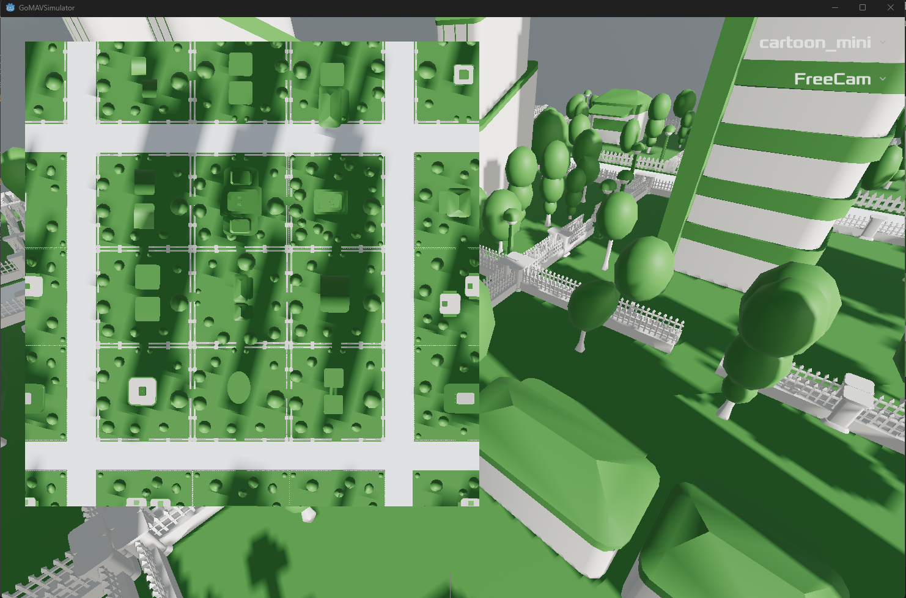

#### Noon to Sunset
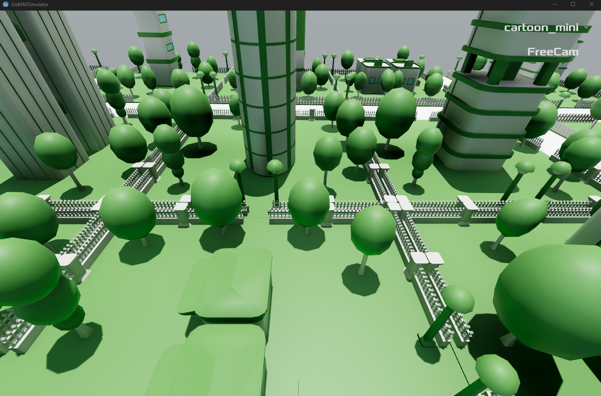
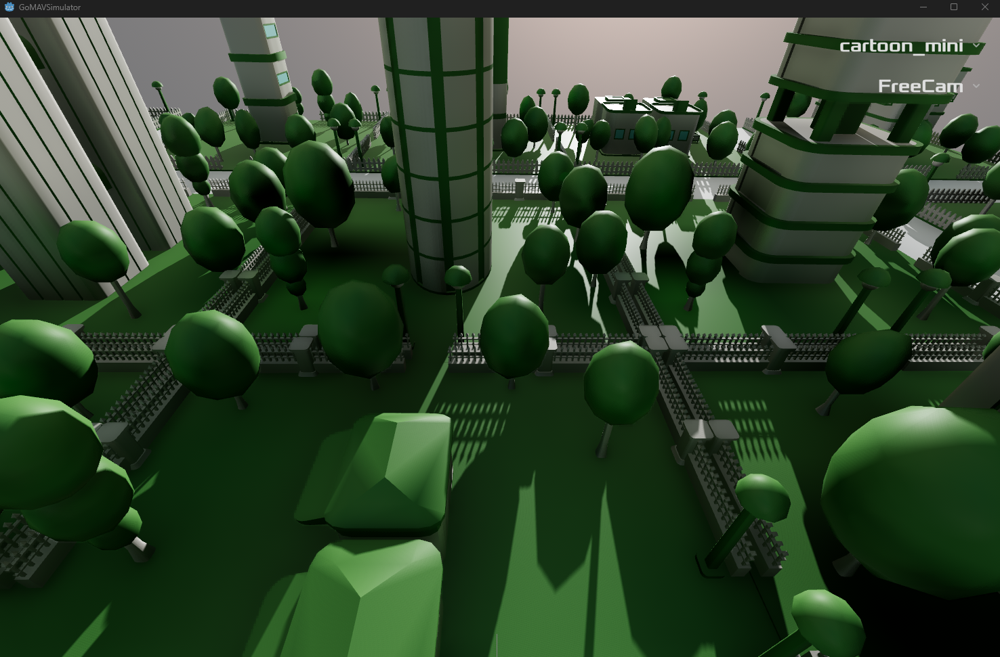

#### Additional Viewer
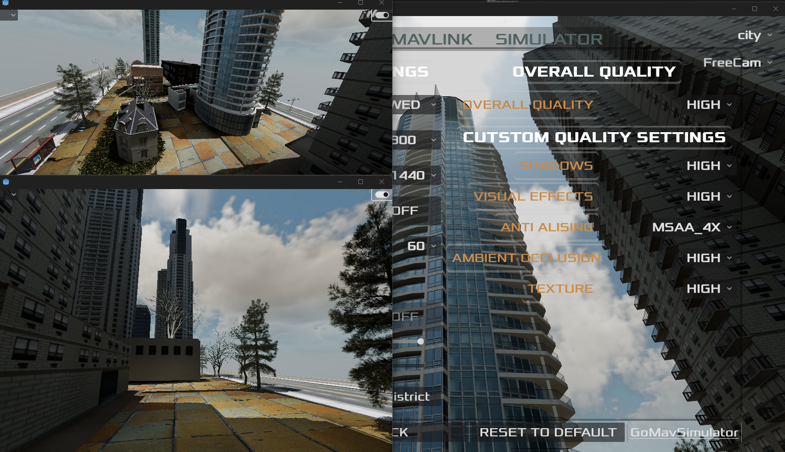
You can set window as always on top on top-right corner button.
There are camera control option on top left corner.

#### Publish district - this is experimental feature
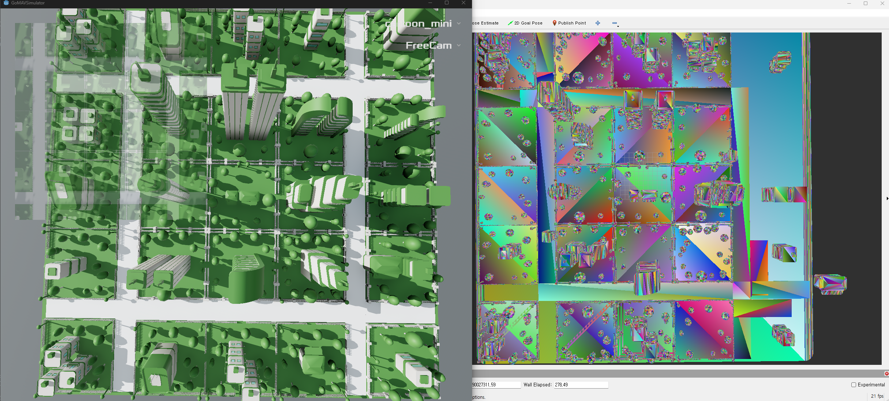

### Mavlink Settings
#### Mavlink Console
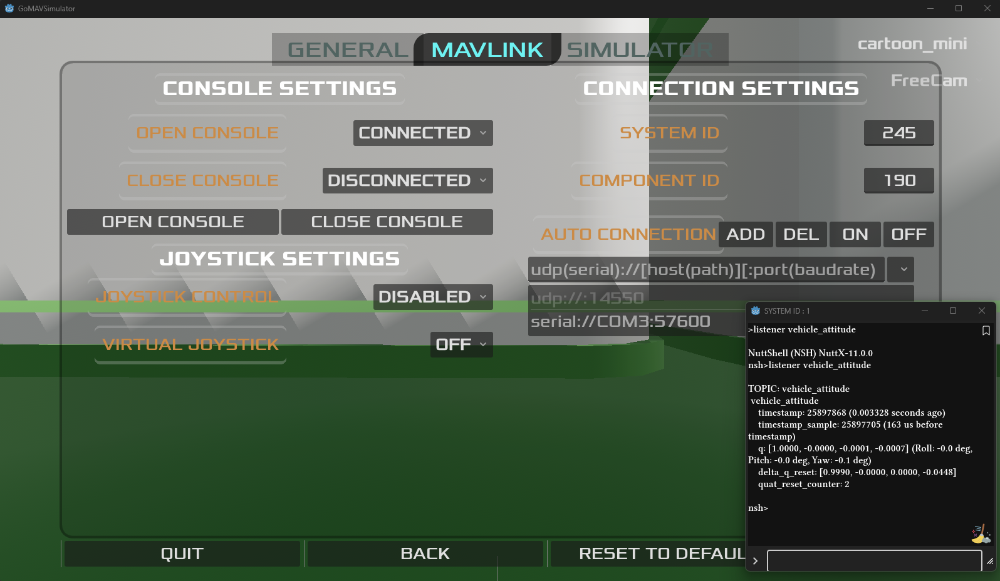
- Mavlink console is automatically opened if you connected to vehicle. (You can disable it)

#### Joystick
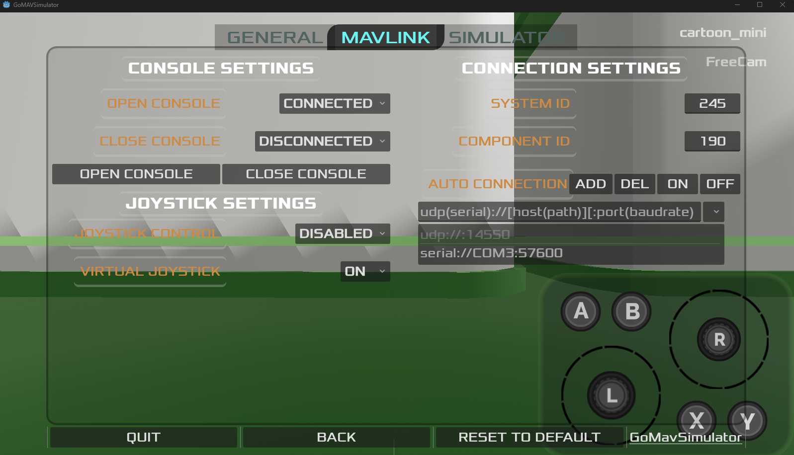
- You can control a mavlink vehicle via joystick or virtual joystick.
- Each button assigned to
    * X : Position Mode
    * Y : Altitude Mode
    * A : Arm
    * B : Disarm
    * L : Throttle(Up/Down), Rudder(Left/Right)
    * R : Elevator(Up/Down), Aileron(Left/Right)
