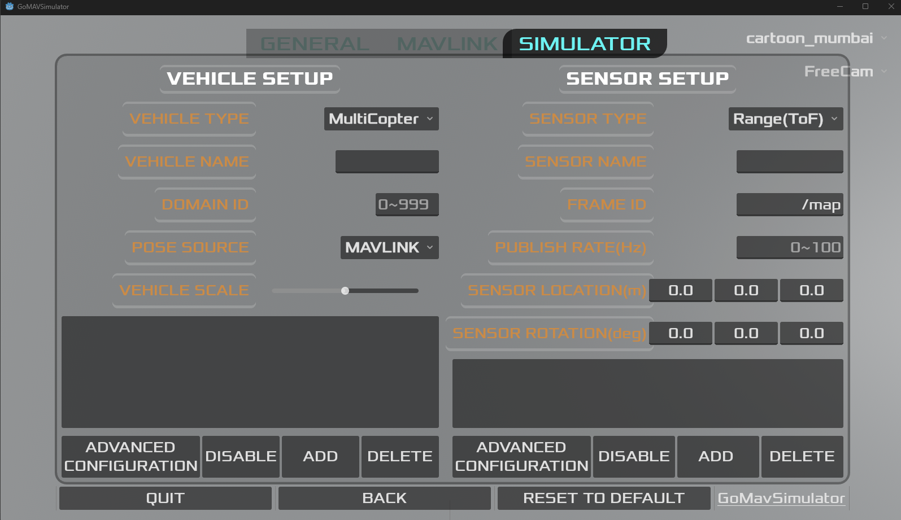
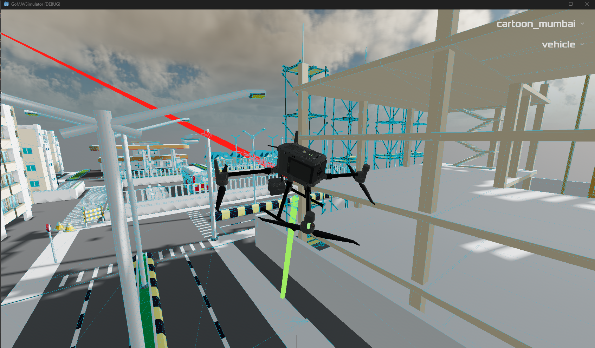
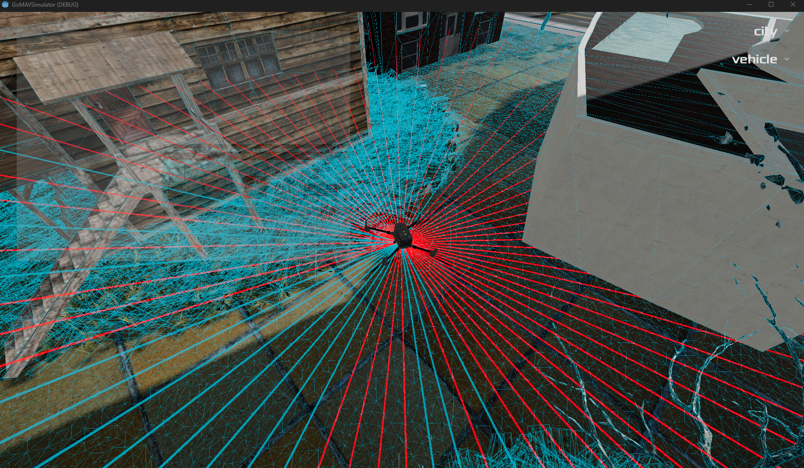
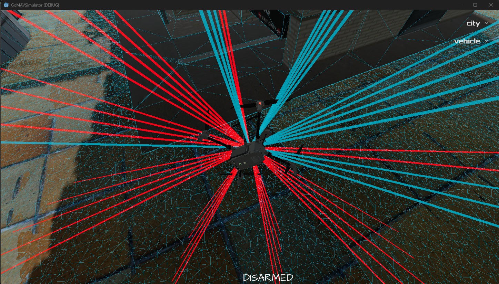
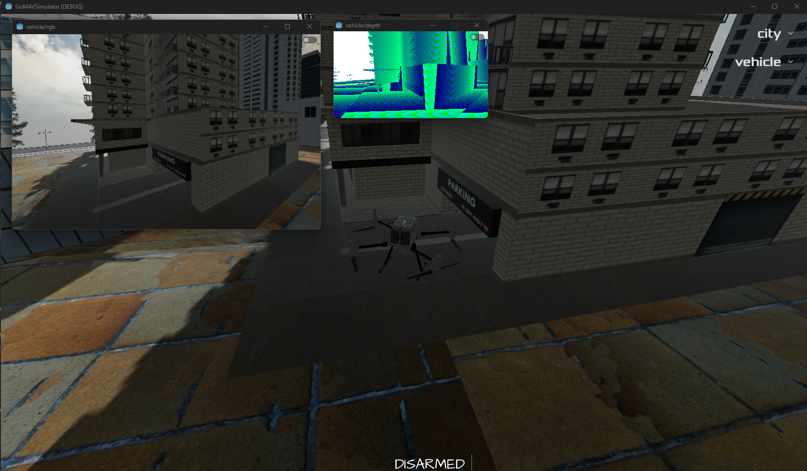

# Vehicle Settings
In this section, methods to add a vehicle and sensors are explained.

## 1. Add a vehicle 
* `All simulated sensor is published to "vehicle name"/"sensor name" with configured domain id.`
* If you select ROS2 as a pose source, `"vehicle name"/pose` is the default listening name of topic. You can configure it option inside of advanced configuration.
* If you select USER as a pose source, vehicle is moved by WASD, Space, C, and mouse. Change camera control to your vehicle if you want to camera is not controlled by keyboard. 
* If you select MAVLINK as a pose source, You need to configure `SYSTEM ID` and Type of internal pose source. (Select ADVANCED CONFIGURATION). If POSE SOURCE is selected as `GROUND TRUTH`, `HIL_STATE_QUATERNION` is used. Otherwise, `ATTITUDE_QUATERNION & LOCAL_POSITION_NED` is used.
* VEHICLE TYPE affects visualization only. You can scaling the visualization.
* Vehicle pose can be published to `"vehicle name"_pose` if you enabling it in advanced configuration.

## 2. Add a sensor
* A sensor location & rotations are uses `ENU(FLU)` as reference frame. The location means sensor's location from center of mass in meter, rotation means ZYX euler angle from vehicle's rotation.
* As a default, `(0,0,0)` rotation means sensor will face `front` direction.
* Configure `publish rate`, `frame id`, as you want. Publish rate more than simulator's frame rate may not effective.

### Range Sensor
 
* Range sensor estimates distance to collision objects. Vehicle model is not considered to collision objects.
* RED sensor is created default `(0,0,0)` rotation.
* Green sensor is created with `(0,90,0)` rotation, which results facing ground.
* You can configure `maximum distance` via advanced configuration
* Publish INFINITY if range is far from maximum distance.

### Lidar Sensor
 
* Vertical fov, resolution, maximum distances are configurable.
* Resolution x means number of rays in same horizontal space.
 
* Resolution x = 10, Resolution y = 5, vertical fov = 25 degree
* Publish INFINITY if range is far from maximum distance.

### RGB / Depth Camera
 
* Camera's `Resolution` and `FoV` can be configured.
* Maximum distance of Depth Camera is `1000m`. (publish infinite if exceeds 1000m)

